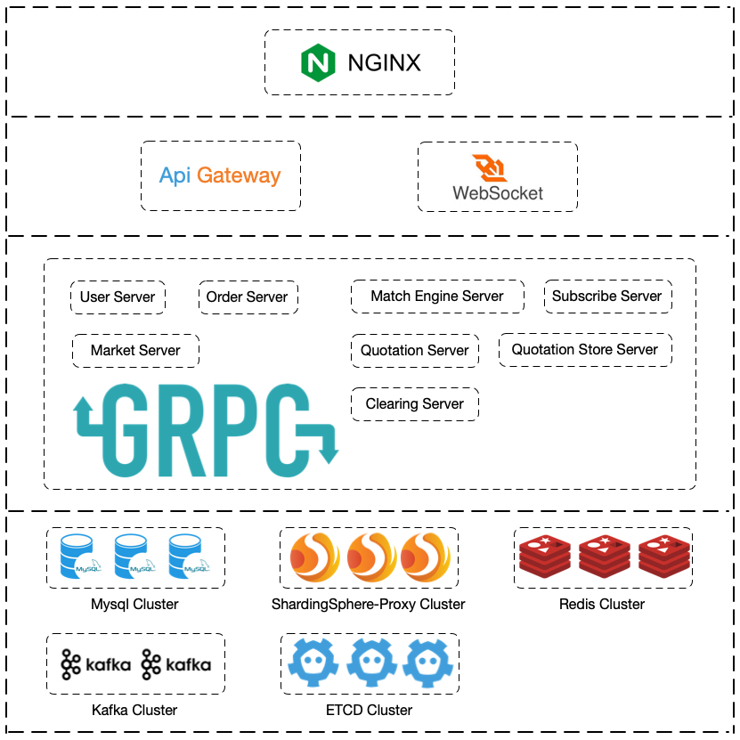

### Golang + Vue3 加密币模拟交易所

线上地址：https://eipistar.us.kg/


#### 本地运行步骤:

1、安装依赖：npm install

2、运行项目：npm run prod

3、处理cookie跨域：打开控制台，修改Cookies的domain。将eipistar.us.kg修改为localhost，刷新当前页面即可。

### 后端架构图:
<center>

</center>

### 撮合交易引擎基准测试
#### int64版本基准测试
```
saeipi@saeipi xengine % go test -bench=.
goos: darwin
goarch: arm64
pkg: lark/pkg/common/xengine
BenchmarkSubmitBuyOrders-8                       5645808               223.4 ns/op
BenchmarkSubmitSellOrders-8                      6197025               232.9 ns/op
BenchmarkOrderMatching-8                         6565600               223.4 ns/op
BenchmarkCancelOrders-8                         45432530                23.44 ns/op
BenchmarkBulkOrderProcessing-8                   4856690               248.6 ns/op
BenchmarkOrderbook5kLevelsRandomInsert-8        13577226                75.25 ns/op
BenchmarkOrderbook10kLevelsRandomInsert-8       15151626                82.45 ns/op
BenchmarkOrderbook20kLevelsRandomInsert-8       12119716                83.93 ns/op
PASS
ok      lark/pkg/common/xengine 12.553s
```

#### decimal版本基准测试
```
saeipi@saeipi xengine % go test -bench=.
goos: darwin
goarch: arm64
pkg: lark/pkg/common/xengine
BenchmarkSubmitBuyOrders-8                       2103273               569.8 ns/op
BenchmarkSubmitSellOrders-8                      2244198               599.9 ns/op
BenchmarkOrderMatching-8                         2139739               619.8 ns/op
BenchmarkCancelOrders-8                          9421946               125.2 ns/op
BenchmarkBulkOrderProcessing-8                    666296              1670 ns/op
BenchmarkOrderbook5kLevelsRandomInsert-8         2632840               424.6 ns/op
BenchmarkOrderbook10kLevelsRandomInsert-8        2358277               575.8 ns/op
BenchmarkOrderbook20kLevelsRandomInsert-8        1819166               703.7 ns/op
PASS
ok      lark/pkg/common/xengine 15.954s
```
